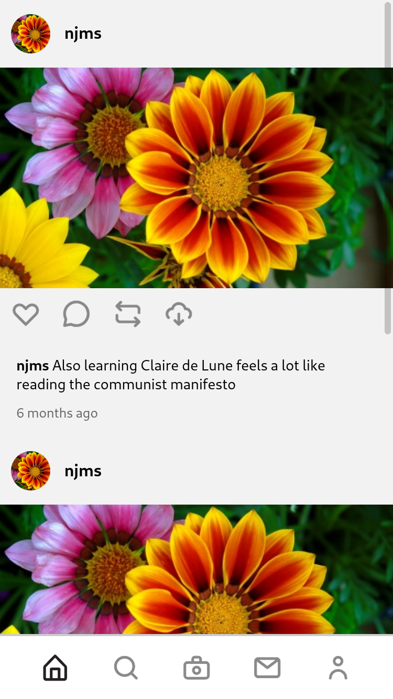
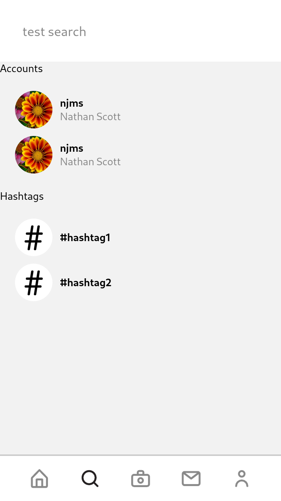
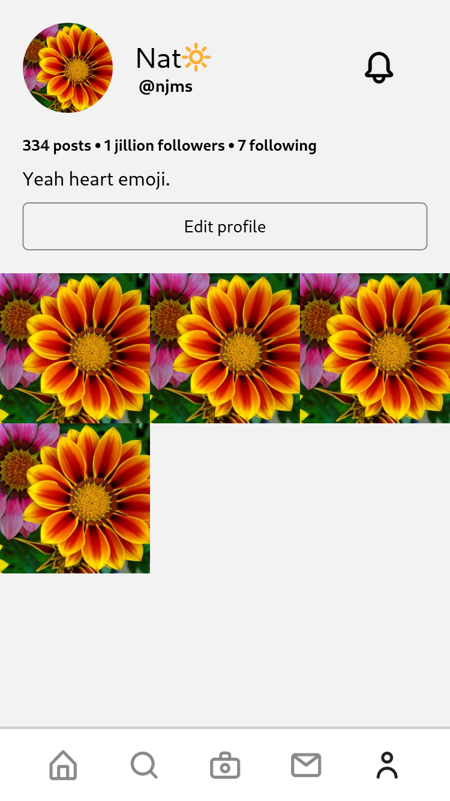

Resin is a Pixelfed client designed to minimize the chance the user will use it
unhealthily. In other words, this app practices
[ethical anti-design](https://njms.ca/posts/ethical-anti-design.html). The way
it does this is by avoiding dark patterns like infinite scrolling and
putting obstacles in place to minimize the risk of the user taking unhealthy
actions that are otherwise unavoidable.

## Goal

The goal of this project is to create a model for what social media could look
like were it not designed to be addictive. The Fediverse, not being dependent
on ad revenue, shouldn't need to capitalize on people's attention. Still, many
of the apps we use to interact with the Fediverse use the same dark patterns 
developed by companies that do. While these dark patterns may seem like industry
standards, we have no need to follow them. This project seeks to demonstrate
the different ways to go about doing that.

## Screenshots

As of late February, the UI of Resin is still ACTIVELY under development and 
will likely change quite a bit. These screenshots probably won't be up to
date most of the time.





## Building

This project is written in React Native and built using Expo.

Here are the steps to build it yourself:

```
$ git clone https://github.com/natjms/resin # Clone the repository
$ npm install # Install the dependencies
$ expo start # start the development server
```

## Contributing

This project is still extremely early in development; however, contributions
are still more than welcome. If you're interested in helping out, the easiest
way to get started would be to contact 
[the project maintainer](https://social.njms.ca/nat) who would be more than
happy to talk to you about it.
